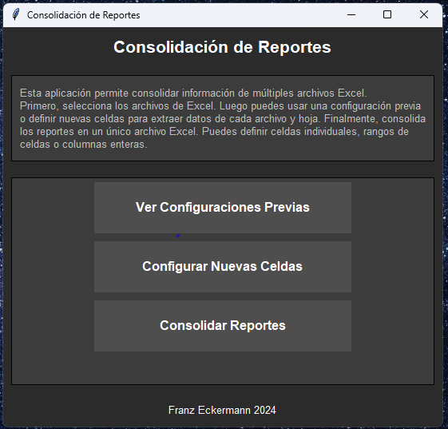
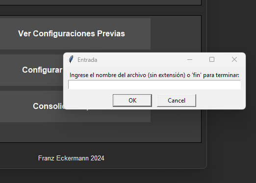

# excel_report_aggregator
Creates an aggregates excel report from various specified  fields coming from different excel reports.
GUI using TKinter that shows various options. 
On start a sqlite db is created which contains all settings. Later on, settings are prompted by the user (which cells/sheets should be used from which excel file). Settings are saved in the database.
User can use the same settings for each run, or reset these settings and create new ones.
Program is in spanish, was originally developed for a custom solution where it was asked to be created in spanish.

## Screenshots
### Main menu

### Enter config values
